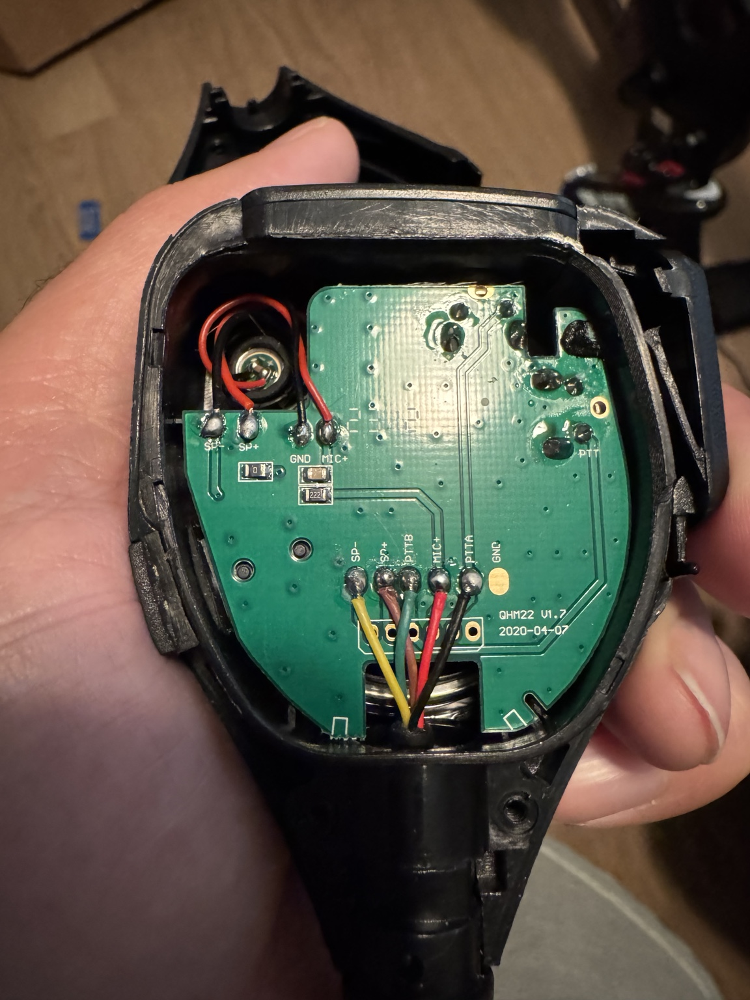
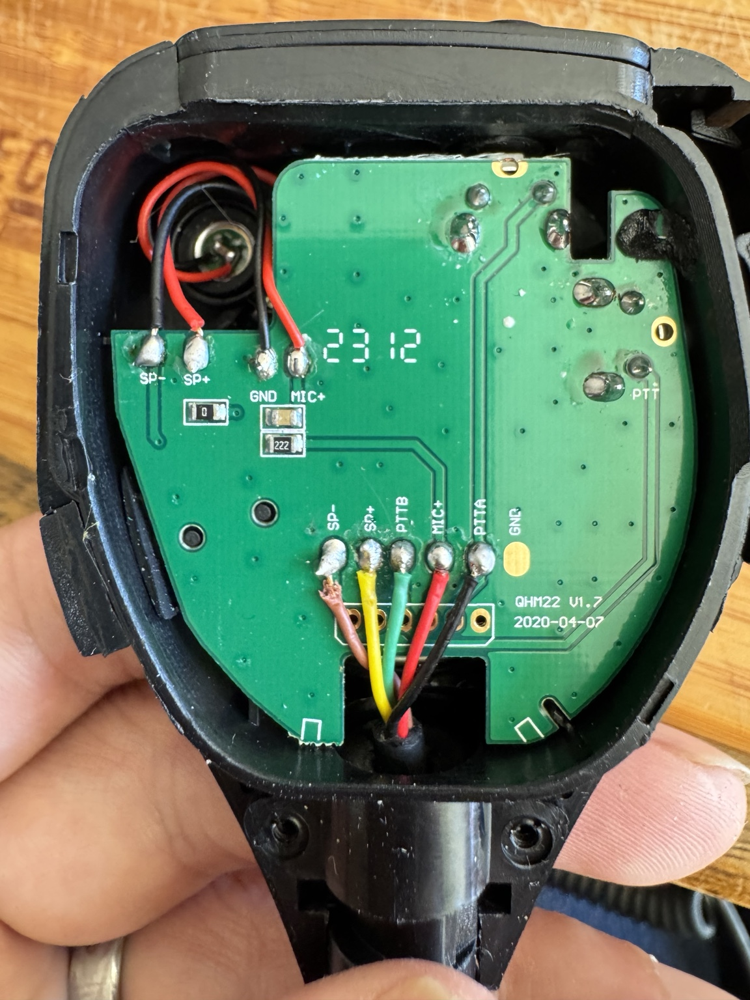

# USB PTT Handset

Turn a two-way-radio speaker microphone into a USB microphone, amplified speaker, and two programmable push-to-talk buttons. One USB cable connects the whole thing to your computer.

Built for [Cabin Fever x86](https://github.com/afourney/cabin-fever-x86), a conversational text-adventure game played over a radio. Also useful anywhere a physical push-to-talk button and a proper shoulder mic make more sense than another keyboard shortcut.


The adapter combines a USB sound card, an LM386 speaker amplifier, and an Adafruit KB2040 running CircuitPython. A tiny USB hub connects the audio and keyboard devices. The microphone audio never passes through the KB2040; the microcontroller only handles the buttons.

**This guide documents the hand-wired, module-based build shown in the photos.** It includes the original wiring diagram and current firmware. No custom PCB is required. The photographed enclosure's CAD/STL files are not included; a suitably sized project box works too.

> **Check the BTECH wiring before connecting it.** The QHM22D used in this build arrived with its yellow and brown speaker wires reversed. That can put speaker audio on the PTT return. [Step 1](#1-test-the-speaker-mic-before-building) explains how to detect it with a multimeter and repair it. Do not swap wires on a unit that already passes the test.

## Contents

- [Parts and tools](#parts-and-tools)
- [Wiring diagram and pinout](#wiring-diagram-and-pinout)
- [1. Test the speaker mic before building](#1-test-the-speaker-mic-before-building)
- [2. Repair the yellow/brown reversal, if present](#2-repair-the-yellowbrown-reversal-if-present)
- [3. Prepare the cables and connector breakout](#3-prepare-the-cables-and-connector-breakout)
- [4. Assemble the USB and power connections](#4-assemble-the-usb-and-power-connections)
- [5. Wire the microphone and speaker amplifier](#5-wire-the-microphone-and-speaker-amplifier)
- [6. Wire the two PTT inputs](#6-wire-the-two-ptt-inputs)
- [7. Install CircuitPython and the firmware](#7-install-circuitpython-and-the-firmware)
- [8. Test the complete adapter](#8-test-the-complete-adapter)
- [9. Mount it in an enclosure](#9-mount-it-in-an-enclosure)
- [Using it with applications](#using-it-with-applications)
- [Troubleshooting](#troubleshooting)
- [References and repository contents](#references-and-repository-contents)

## Parts and tools

### Electronics

Links identify the documented parts or a suitable reference part, not a guarantee that a current shipment has the same board revision. Match the electrical requirements when substituting.

| Qty | Part | Purpose and selection notes |
| ---: | --- | --- |
| 1 | [BTECH QHM22D dual-PTT speaker microphone](https://baofengtech.com/product/qhm22d/) · [Amazon](https://www.amazon.com/dp/B085HG7RX8) | Kenwood K1-style two-plug connector, speaker, microphone, and two buttons. This guide's dual-button mapping is specific to the checked/repaired QHM22D. |
| 1 | [Adafruit KB2040, product 5302](https://www.adafruit.com/product/5302) | RP2040 board for USB HID keyboard events. The supplied firmware uses its `D2`, `D3`, and `BUTTON` names. |
| 1 | [Adafruit CH334F Mini 2-Port USB Hub Breakout, product 5999](https://www.adafruit.com/product/5999) | Connects sound card and KB2040 to one upstream USB cable. Downstream connections are solder pads. |
| 1 | USB audio adapter with separate microphone and headphone jacks · [documented reference: Adafruit 1475](https://www.adafruit.com/product/1475) | Needs a microphone input suitable for an electret mic, including mic bias, and a ground-referenced headphone/line output. The exact SKU of the cabled adapter in the photos is unrecorded; do not assume its jack wiring from its appearance. |
| 1 | [LM386 audio amplifier module](https://protosupplies.com/product/lm386-audio-amplifier-module/) | The documented blue module has an input level trimmer and an output coupling capacitor. Use the ground-referenced output described below. The prototype had its gain-setting **R1 removed**. |
| 2 | 10 kΩ resistors | One pull-up from each PTT input to the KB2040's regulated **3.3 V** output. Ordinary ¼ W resistors are sufficient. |
| 1 | Small solderable prototyping board | Carries the audio/PTT junctions and two resistors. A breadboard-layout solder board is convenient. |

### Connectors and mounting

| Qty | Part | What to check |
| ---: | --- | --- |
| 1 set | K1-compatible female breakout, or separate **3.5 mm TRS** and **2.5 mm** sockets/pigtails | Must expose all five used contacts. A mono 3.5 mm socket loses the second PTT or mic contact. Separate flying sockets avoid fixed-spacing problems with the molded K1 plug. |
| 2 | Short 3.5 mm male audio pigtails/breakouts | One for sound-card mic input; one for headphone output. Identify their conductors with a meter. |
| 1 | Short USB-C data pigtail for the KB2040 | Connect its USB power/data to a hub downstream port. Using the USB-C socket preserves the board's normal power-entry path. |
| 1 | USB connection for the sound card | A female USB-A pigtail if retaining a USB-A dongle, or the adapter's existing USB cable if deliberately shortened. |
| 1 | Upstream USB **data** cable | Computer to the hub's USB-C socket; choose the computer-end connector you need. |
| As needed | Insulated hookup wire, heat-shrink, solder, cable ties, standoffs, screws | Keep USB data wiring short and paired. Insulate exposed connections and provide cable strain relief. |
| 1 | Nonconductive project box and mounting plate | Size around your assembled modules, plug bodies, cable bends, and lid clearance. See [enclosure notes](docs/enclosure.md). |

The original diagram also shows an optional 9 V amplifier supply. **The instructions below use USB 5 V throughout.** A boost converter is unnecessary for the basic build; the prototype's 5 V/9 V comparison did not show a useful improvement for voice. Never feed 9 V into USB power, the KB2040, or a PTT input.

You will also need a multimeter with a low-ohms range, a soldering iron and flux, cutters/strippers, small screwdrivers, and a computer for copying files and testing USB audio. Fine tweezers and desoldering braid help with the amplifier's surface-mount gain resistor.

## Wiring diagram and pinout

[](hardware/speaker-mic-converter.svg)

[Open the editable SVG](hardware/speaker-mic-converter.svg) · [Open the full-size PNG](hardware/speaker-mic-converter.png)

This is the original **functional wiring diagram**, not a PCB layout or a drawing of connector solder-lug order. Its microphone block simplifies the handset's internal circuitry. Use the tests below to verify your particular handset's switching behavior.

**Tip** is the end of a plug, **ring** is the middle contact between insulating bands, and **sleeve** is the contact nearest the cable. The table refers to the two plugs that normally go into a radio, not the extra headphone jack on the handset.

| QHM22D plug contact | Signal | Adapter connection |
| --- | --- | --- |
| 2.5 mm tip | Speaker signal | LM386 module's capacitor-coupled `OUT` |
| 2.5 mm sleeve | Common return | Common ground |
| 3.5 mm ring | Microphone signal | Sound-card microphone input, with the sound card providing mic bias |
| 3.5 mm sleeve | PTT1, active low | KB2040 `D2` / pad **2**, plus 10 kΩ to `3V` |
| 3.5 mm tip | PTT2, active low | KB2040 `D3` / pad **3**, plus a separate 10 kΩ to `3V` |

Leave any unused 2.5 mm ring contact unconnected. **Do not ground the 3.5 mm sleeve:** in this build it is a button input. Ground comes from the **2.5 mm sleeve**. These assignments describe the repaired QHM22D; a different K1 accessory may implement its microphone or second button differently.

### K1 accessory pinout


[Full-size PNG](hardware/k1-accessory-pinout.png) · [Editable SVG](hardware/k1-accessory-pinout.svg)

The black circuit shows the usual single-button speaker-mic wiring. **Disregard the cyan paths for a single-button accessory.** Cyan adds the optional secondary PTT used by the UV-82 and compatible dual-PTT speaker mics. On this QHM22D, **PTT Main** is the large side button (`PTT1` / `D2`), and **PTT Secondary** is the small top button (`PTT2` / `D3`). Both switches return to the **2.5 mm sleeve**; the 2.5 mm tip remains the speaker signal. Dual PTT does not require reversing those speaker contacts.

This is an accessory reference, not an exact schematic of the QHM22D's internal microphone circuit. The 10 µF capacitor belongs to the reference drawing; it is not an extra component required by this adapter's build instructions. The optional secondary-PTT connection is not universal to K1 radios: for example, Kenwood's TH-F6A/TH-F7E uses the 3.5 mm tip for a supply output.

**Sources and attribution:** adapted from [The (Chinese) Radio Documentation Project's original SVG](https://github.com/radiodoc/uv-5r/blob/master/assets/images/kenwood-2pin-headset.svg), published with its [UV-5R manual](https://radiodoc.github.io/uv-5r/), under [CC BY-SA 3.0](https://creativecommons.org/licenses/by-sa/3.0/). This adaptation removes the +5 V label, adds the cyan secondary-PTT circuit, and revises the labels and captions; the adapted PNG and SVG retain that license. Dual-PTT wiring is based on [Miklor's UV-82 technical notes](https://www.miklor.com/COM/UV_Technical.php), its [labeled connector photograph](https://www.miklor.com/COM/images/dualPTT.jpg), and [Walt N3PLA's circuit diagram](https://www.miklor.com/COM/images/dualPTT-N3PLA.jpg). [Kenwood's TH-F6A/TH-F7E manual, printed page 45](https://kasc.kenwood.com/files/images/products/product_id_268/file_category_10/TH-F6A_F7E_inst.pdf#page=50), corroborates the conventional speaker, microphone, and main-PTT contacts. [BaoFeng Tech's UV-82HP manual, printed page 19](https://baofengtech.com/wp-content/uploads/2020/09/UV82HP_Manual_ReducedSize.pdf#page=26), documents upper/lower-channel PTT operation; its generic accessory drawing does not show the second switch.

## 1. Test the speaker mic before building

The defect is easy to miss: the internal speaker can still make sound with reversed leads. The important problem here is where the PTT switch connects, not just acoustic polarity.

1. Disconnect the handset from everything: radio, adapter, USB, and any external earphones.
2. Set the meter to resistance, preferably its lowest useful range. Touch the probes together and note the lead resistance.
3. Identify the **2.5 mm tip**, **2.5 mm sleeve**, and **3.5 mm sleeve** on the handset's radio plug.
4. Measure between the two sleeves while holding the PTT button associated with the **3.5 mm sleeve**. On a dual-button handset, try each button separately to identify it; this guide calls that input PTT1.
5. Keep that same button pressed and measure between the **2.5 mm tip** and **3.5 mm sleeve**.
6. Compare the pair of readings with the table. Use actual resistance values: a continuity buzzer may beep for both 0 Ω and 8 Ω.

### Test 1: sleeve to sleeve

Hold PTT1. Touch the **black probe to the 3.5 mm sleeve** and the **red probe to the 2.5 mm sleeve**. A correctly wired unit reads approximately **0 Ω**; the reversed unit reads the speaker's resistance, approximately **8–9 Ω**.

[](hardware/testing/qhm22d-test-1.svg)

### Test 2: move one probe to the tip

Keep **the same PTT button held** and the **black probe on the 3.5 mm sleeve**. Move only the **red probe to the 2.5 mm tip**. The readings should exchange: approximately **8–9 Ω** when correctly wired, or approximately **0 Ω** on the reversed unit.

[](hardware/testing/qhm22d-test-2.svg)

The drawings show the **radio-end plugs**, not the handset's headphone socket. Touch one exposed metal segment with each probe; avoid bridging a black insulating band. The probe colours are for clarity—either polarity works for these two resistance checks. Click either diagram to open its editable SVG.

| Measurement, with PTT1 held | Correct wiring | Reversed wiring on this unit |
| --- | --- | --- |
| 2.5 mm **sleeve** ↔ 3.5 mm sleeve | Approximately **0 Ω** plus probe/contact resistance | Approximately **8 Ω**, through the speaker |
| 2.5 mm **tip** ↔ 3.5 mm sleeve | Approximately **8 Ω**, through the speaker | Approximately **0 Ω** |

The speaker in this build measured around **8–9 Ω**; treat that as a recognizable speaker-coil reading, not a precision acceptance limit. Swapping the meter probes does not change which test is which—the distinction is **tip versus sleeve on the 2.5 mm plug**.

Release PTT1 and verify that the sleeve-to-sleeve short disappears. Also identify PTT2 by testing **3.5 mm tip ↔ 2.5 mm sleeve**: the repaired handset should change from open/high resistance to near zero when its other button is held. If the switching or resistance pattern differs substantially, trace the accessory before using this wiring plan.

### Reports of the same problem

- [Amazon review: “repair the factory defect and then it works great,” September 4, 2022](https://www.amazon.com/gp/customer-reviews/RETJVNP2EQFWO). The reviewer describes reversed speaker leads and loss of PTT when external headphones are connected. Amazon may require sign-in; the review's supplied screenshot was used as a reference and is not redistributed here.
- [Independent repair report: “Comms at Home, QHM22D question”](https://www.reddit.com/r/Baofeng/comments/123nzs1/comms_at_home_qhm22d_question/). The discussion links that exact Amazon review, and the owner reports that the repair worked.
- [Earlier first-hand symptom report](https://www.reddit.com/r/Baofeng/comments/lg8wdt/help_baofeng_qhm22d_dual_ptt_speaker_mic_stops/). The original post is deleted, so the remaining thread provides limited context; it is not proof of a particular internal fault.
- [Adam Fourney's review on BTECH's product page](https://baofengtech.com/product/qhm22d/#reviews), September 8, 2026, records this build's resistance readings and repair. This is the same unit documented here, not an additional independent sample.

These are reports about particular units, not evidence that every QHM22D is wired incorrectly.

## 2. Repair the yellow/brown reversal, if present

Only do this if your measurements identify the reversal. Returning a defective unit is also an option.

1. With the handset completely disconnected, remove the two screws on its back.
2. Carefully open the housing without pulling on the speaker or microphone leads. Photograph the original wiring.
3. Locate the **lower row of cable connections** on the PCB, beside the cable entry. On the photographed board the labels read `SP−`, `SP+`, `PTTB`, `MIC+`, and `PTTA`.
4. Desolder the **yellow** lead from `SP−` and the **brown** lead from `SP+`. Let the solder melt before lifting each wire; do not pull up a pad.
5. Reconnect **brown to `SP−`** and **yellow to `SP+`**. Leave the adjacent green, red, and black cable wires alone. Leave the separate red/black wires to the speaker and microphone at the top of the board alone too.
6. Inspect for solder bridges, loose strands, damaged insulation, and a secure cable entry. Wire colours can change between revisions; the labels and measurements take precedence.
7. Repeat both PTT1 resistance measurements and the PTT2 switching check **before reconnecting anything powered**. The two PTT1 readings should now match the correct-wiring column.
8. Refit the housing without pinching wires or disturbing its seal.

| Before: factory reversal on this unit | After: corrected cable connections |
| --- | --- |
|  |  |
| `SP−`: yellow · `SP+`: brown | `SP−`: brown · `SP+`: yellow |

Both pictures show the actual handset used in this project. The swap is on the **incoming cable pads at the bottom**, not the speaker's own two wires at the top.

## 3. Prepare the cables and connector breakout

1. Plug the handset into the unpowered mating sockets. Check that both plugs seat fully; a partly inserted plug can join the wrong contacts.
2. Use continuity measurements to map every socket lug or pigtail wire to its plug contact. If a socket has switching contacts, identify the lug connected to the inserted plug, not its normally closed switch lug.
3. Label the five wires `SPK`, `GND`, `MIC`, `PTT1`, and `PTT2` using the pinout table above. Insulate unused contacts.
4. Map the two sound-card audio pigtails separately. On a conventional stereo headphone output, tip is left, ring is right, and sleeve is ground. Microphone jack conventions vary: follow your adapter's documentation or verify its input and bias arrangement with a known working microphone before cutting cables.
5. Verify the sound card and KB2040 separately over USB before modifying any USB lead. Label the mic and speaker plugs so they cannot be exchanged during assembly.

The K1 **3.5 mm ring** connects to the sound card's **microphone signal input**. That does not mean it necessarily connects to the ring of the sound card's own jack. Match functions, not plug positions or wire colours.

## 4. Assemble the USB and power connections

Keep power disconnected while soldering. The hub's upstream port goes to the computer; its two downstream ports go to the sound card and KB2040.

| From | To |
| --- | --- |
| Hub downstream port 1: 5 V, D+, D−, GND | Sound-card USB: 5 V, D+, D−, GND respectively |
| Hub downstream port 2: 5 V, D+, D−, GND | KB2040 USB-C pigtail: VBUS, D+, D−, GND respectively |
| USB 5 V supply at the hub | LM386 module `VCC` |
| Common GND | LM386 grounds, sound-card audio grounds, KB2040 GND, and K1 2.5 mm sleeve |

1. Wire each downstream USB connection as its own four-wire connection. **D+ goes to D+ and D− to D−**; the two devices do not share a data pair.
2. Keep each USB data pair together, short, and away from the audio input wiring. Retain the original cable's paired wiring where possible.
3. Connect the amplifier supply and common ground. Take amplifier power from the USB 5 V supply, not the KB2040's `3V` pin.
4. Before power-up, check for shorts between supply and ground and between neighboring pads. Capacitors may briefly charge from the meter; investigate a persistent near-zero supply-to-ground reading.
5. With the handset still disconnected, connect the hub to the computer. Confirm that both USB devices appear, then disconnect power again before continuing.

The schematic labels the KB2040 power connection functionally as “5 V.” This guide routes it through a USB-C pigtail. If reproducing direct pad wiring, consult the [KB2040 pinout](https://learn.adafruit.com/adafruit-kb2040/pinouts): `RAW`, the USB VBUS connection, and `3V` are not interchangeable labels. Never attach a second computer USB cable to the KB2040 while its hub USB data connection is attached.

See also the [hub pinout](https://learn.adafruit.com/adafruit-ch334f-mini-4-port-usb-hub-breakout/pinouts), which covers both hub sizes.

## 5. Wire the microphone and speaker amplifier

### Microphone

Connect K1 **3.5 mm ring → sound-card microphone signal** and **2.5 mm sleeve → sound-card mic ground**. Use a microphone input that supplies suitable electret bias; a line input without bias is not a drop-in substitute. The LM386 amplifies playback only—it is not a microphone preamp.

### Speaker

1. Connect sound-card **left output → LM386 `IN`** and output ground to the module input ground. Leave the sound-card right output unconnected and insulated. Do not short the two output channels together.
2. Connect the LM386 module's **capacitor-coupled `OUT` → K1 2.5 mm tip** and its output ground to **K1 2.5 mm sleeve**.
3. Start with the amplifier's level trimmer turned down. The small radio speaker needs a power amplifier: connecting this build's sound card directly produced very quiet playback.

**Use the module's speaker output after its coupling capacitor, not the LM386 chip's bare output pin.** Also, do not substitute a bridge-output amplifier such as a typical PAM8403 board into this wiring: its speaker “minus” output is not common ground. This adapter relies on a grounded return shared by the audio and buttons.

### Reduce excessive gain

The documented LM386 module starts at approximately 200× gain. The prototype's **R1 was removed to open its gain-boost path**, returning the amplifier to its lower-gain configuration. This gives more usable adjustment with a sound-card output.

With power disconnected, confirm the module revision and trace that R1 really is in the gain-setting path associated with LM386 pins 1 and 8 before removing it. **“R1” is a board-specific label.** Do not remove an arbitrary resistor on a different module, and do not bridge the pads after removal. Leave the output coupling capacitor in place.

The [TI LM386 datasheet](https://www.ti.com/lit/ds/symlink/lm386.pdf) explains the underlying behavior: the chip has a gain of 20 with the external gain-boost network absent, and that network can raise it to 200. The onboard trimmer reduces the input level; it is not the same adjustment as changing the chip's gain. Excessive input still clips at either gain setting.

## 6. Wire the two PTT inputs

1. Connect K1 **3.5 mm sleeve → KB2040 pad 2** (`board.D2`).
2. Connect K1 **3.5 mm tip → KB2040 pad 3** (`board.D3`).
3. Fit a **10 kΩ resistor from pad 2 to `3V`**.
4. Fit a **separate 10 kΩ resistor from pad 3 to `3V`**.
5. Confirm KB2040 GND connects to the common ground / K1 2.5 mm sleeve.

The `3V` pin provides regulated **3.3 V**. Do not pull the GPIOs up to USB 5 V. Board pads **2 and 3** are not **A2 and A3**.

With power applied after inspection, each released PTT input should measure near 3.3 V relative to ground, dropping near 0 V when its corresponding button is held. Disconnect power again before moving any wiring. Both inputs must have a pull-up even if you only plan to use one button.


The build photo shows the LM386 at the top, the prototyping board in the middle, the KB2040 and USB hub below, and the separate USB audio adapter to the right. Follow the schematic and contact labels rather than copying wire colours from this overview.

## 7. Install CircuitPython and the firmware

1. Download the stable [CircuitPython UF2 for **Adafruit KB2040**](https://circuitpython.org/board/adafruit_kb2040/).
2. With the board unplugged, hold **BOOT** while connecting its USB data cable. Release BOOT when the `RPI-RP2` drive appears. If the board is already wired to the hub, use that connection instead of a second USB cable.
3. Copy the `.uf2` file to `RPI-RP2`. The board restarts and exposes a drive named `CIRCUITPY`.
4. Download the [Adafruit CircuitPython library bundle](https://circuitpython.org/libraries) matching the major CircuitPython version in `CIRCUITPY/boot_out.txt`.
5. Copy the bundle's entire `adafruit_hid` folder into **`CIRCUITPY/lib/adafruit_hid/`**.
6. Copy [firmware/code.py](firmware/code.py) to **`CIRCUITPY/code.py`**. It belongs in the drive root, not inside `lib`. On Windows, show file extensions and check that it is not named `code.py.txt`.
7. Saving the file normally restarts the program. Later edits require only saving `code.py`, not flashing the UF2 again.

The supplied configuration is:

```python
PTT1_KEY = Keycode.F13
PTT2_KEY = (Keycode.LEFT_CONTROL, Keycode.SPACE)
BOOT_ALIASES_PTT1 = True
USE_INTERNAL_PULLUPS = False
DEBOUNCE_SECONDS = 0.020
POLL_SECONDS = 0.002
LOG_CHANGES = True
```

| Input | While held | On release |
| --- | --- | --- |
| PTT1 / D2 | F13 | Releases F13 |
| PTT2 / D3 | Left Ctrl + Space | Releases the chord |
| Onboard BOOT, after normal startup | F13 | Releases F13 when D2 is also released |

Each input is debounced for 20 ms. The program combines the held keys, so releasing BOOT does not release F13 while PTT1 is still held. It holds keys as a keyboard would; it does not repeatedly tap them. The operating system may generate key-repeat events.

**External pull-ups are required by the default firmware.** For a temporary test of a bare KB2040 without the resistors, set `USE_INTERNAL_PULLUPS = True` before running it; restore `False` when both external 10 kΩ resistors are installed. Otherwise unconnected inputs float and can send unintended keys.

Change a binding near the top of the file to suit your app, for example `PTT2_KEY = Keycode.SPACE` or `PTT2_KEY = Keycode.F14`. A chord is a tuple, as in the default Ctrl+Space binding. The onboard BOOT alias is only for testing during normal operation; holding BOOT at startup enters the bootloader.

## 8. Test the complete adapter

### Buttons first

1. Open the [W3C Keyboard Event Viewer](https://w3c.github.io/uievents/tools/key-event-viewer.html) and focus its input.
2. Hold PTT1: expect F13 down. Release it: expect F13 up. F13 does not type a visible character.
3. Hold PTT2: expect Control and Space with Ctrl active. Release it and check that **both** keys are released.
4. Hold both handset buttons; release them in each order. Each input should release without interfering with the other.
5. Hold PTT1 and BOOT together, then release one. F13 should remain down until both are released.
6. Unplug and reconnect USB. Verify the buttons recover and no key is left held.

If these checks fail, use the [serial-console guide](docs/serial-console.md). Do not debug application keybindings until the underlying HID events are right.

### Then audio

1. Select the USB sound card as the computer's input and output device, or select it explicitly in the application. Device names vary.
2. Record a short voice sample while holding each handset button in turn. Verify the mic signal and identify any button-dependent audio behavior before configuring software PTT.
3. Start playback at low computer volume and low amplifier level. Slowly raise the level while listening to speech.
4. If the speaker sounds harsh or buzzy, turn down the computer output or amplifier input trimmer. The prototype was clear for voice but could clip on music.
5. Because only the left output is connected, enable mono playback in the host's accessibility/audio settings when you want both channels of stereo material. Otherwise right-only content will be missing.
6. Disable microphone monitoring / “Listen to this device” if the speaker feeds back into the microphone.

This adapter supplies audio endpoints and keyboard events. **The HID firmware does not mute the USB audio device.** Verify the target application's recording/mute behavior on both press and release; do not treat the handset buttons as a guaranteed hardware privacy switch.

## 9. Mount it in an enclosure

Test the complete assembly before closing the box. Mount each board on an insulating plate or standoffs, secure the audio adapter, and strain-relieve the USB and K1 cables. Leave room for the plug bodies and access to the amplifier trimmer and KB2040 reset/BOOT buttons. Keep solder joints clear of screws and the lid.

| Open enclosure | Finished cable entry |
| --- | --- |
|  |  |

See [enclosure and mounting notes](docs/enclosure.md) for fitting a project box. After mounting, repeat the button and audio tests while gently moving the cables. Nothing should disconnect, crackle, or generate a button press from cable movement.

## Using it with applications

Choose the USB sound card for audio, then configure the PTT key separately. A working mic input does not imply that an application recognizes F13 or Ctrl+Space.

### Cabin Fever x86

Use the adapter with [Cabin Fever x86](https://github.com/afourney/cabin-fever-x86). Select the USB microphone, grant the browser microphone permission, and route playback to the USB sound card. Match the handset's firmware binding to the game's current PTT control. Check that releasing the button ends the recording before a full session.

### Claude Code

Select the USB microphone as the host's input, enable `/voice hold`, and focus the prompt. Claude Code's default dictation key is Space; to test that path, set `PTT2_KEY = Keycode.SPACE` in the firmware. In hold mode, terminal key repeat must be enabled. See the official [voice dictation guide](https://code.claude.com/docs/en/voice-dictation).

To try the repository's **default Ctrl+Space** instead, merge the following into `~/.claude/keybindings.json` in the environment running Claude Code:

```json
{
  "bindings": [
    {
      "context": "Chat",
      "bindings": {
        "ctrl+space": "voice:pushToTalk"
      }
    }
  ]
}
```

This is a configuration example, **not a confirmed fix for Windows Terminal/WSL2**. Ctrl+Space did not work reliably in the original setup. Check terminal shortcut interception and the key received by Claude Code; use `/keybindings` and the [keybinding documentation](https://code.claude.com/docs/en/keybindings). A native browser receiving the HID chord does not prove that the terminal forwards it correctly. For WSL, also verify that its audio input works through WSLg.

### Microsoft Teams

Select the USB mic and speaker in Teams, then check the installed client's keyboard shortcuts for its press-and-hold temporary-unmute action. The firmware's Ctrl+Space binding is intended for clients that offer that shortcut. Test from a muted meeting with the intended window focus: hold to speak, release, and verify that the mute indicator returns. A single shared keybinding working in both Teams and Claude Code has **not been established for this build**.

## Troubleshooting

| Symptom | Check |
| --- | --- |
| Speaker works, but PTT fails or changes when headphones are inserted into the handset | Run the unpowered yellow/brown reversal test in Step 1. |
| Random key presses, or a button appears held | Both 10 kΩ pull-ups must connect to 3.3 V; confirm repaired handset ground, correct socket contacts, and that the plugs are fully seated. |
| PTT is always active | Check that the K1 3.5 mm sleeve was not mistaken for common ground. |
| BOOT works but handset buttons do not | Check D2/D3 versus A2/A3, connector continuity, pull-ups, and each switch's resistance to ground. |
| Nothing appears over USB | Use a data cable; inspect upstream/downstream assignment, D+/D−, 5 V, and GND. Test each device separately. |
| Audio or keyboard disappears when the speaker gets loud | Reduce playback level; investigate supply sag, shorts, poor ground connections, and the USB source's current budget. |
| Speaker is extremely quiet | Check that playback passes through the powered LM386 and its level trimmer is not at minimum. |
| Harsh or distorted playback | Lower sound-card output and amplifier input level; confirm the intended gain modification. |
| No mic signal | Check the selected USB input, app permission, mic bias, K1 ring mapping, and whether the handset gates audio with its buttons. |
| Music is missing instruments or voices | Only the left channel is wired. Enable host mono output. |
| Firmware import error | Install the matching `adafruit_hid` folder under `CIRCUITPY/lib/`. |
| Keys work in a browser but not Claude Code | Check terminal key translation/interception and Claude Code's active binding. |
| Serial console is blank or PuTTY beeps | Follow [serial-console setup](docs/serial-console.md), including selecting Serial on the Session page. |

## References and repository contents

| File | Purpose |
| --- | --- |
| [README.md](README.md) | Complete build, repair, setup, and test guide |
| [firmware/code.py](firmware/code.py) | Current CircuitPython firmware: F13 / Ctrl+Space, external pull-ups |
| [hardware/speaker-mic-converter.svg](hardware/speaker-mic-converter.svg) | Original editable functional wiring diagram |
| [hardware/speaker-mic-converter.png](hardware/speaker-mic-converter.png) | Original raster export for inline viewing |
| [K1 accessory pinout PNG](hardware/k1-accessory-pinout.png) / [editable SVG](hardware/k1-accessory-pinout.svg) | General accessory wiring with optional secondary PTT highlighted in cyan; adapted artwork, CC BY-SA 3.0 |
| [Test 1 diagram](hardware/testing/qhm22d-test-1.svg) / [Test 2 diagram](hardware/testing/qhm22d-test-2.svg) | Probe-placement diagrams with correct/reversed readings; PNG copies are alongside the SVGs |
| [docs/serial-console.md](docs/serial-console.md) | Windows serial logging and firmware troubleshooting |
| [docs/enclosure.md](docs/enclosure.md) | Mounting guidance and current CAD availability |
| [docs/references.md](docs/references.md) | Source links and what each establishes |
| [docs/maintainer-notes.md](docs/maintainer-notes.md) | Provenance, validation scope, and remaining release details |

Build and original photographs: **Adam Fourney**. The Amazon screenshot is intentionally excluded. The project documents a working prototype; reproducing it still requires checking your own module revisions, connector wiring, and application behavior.
