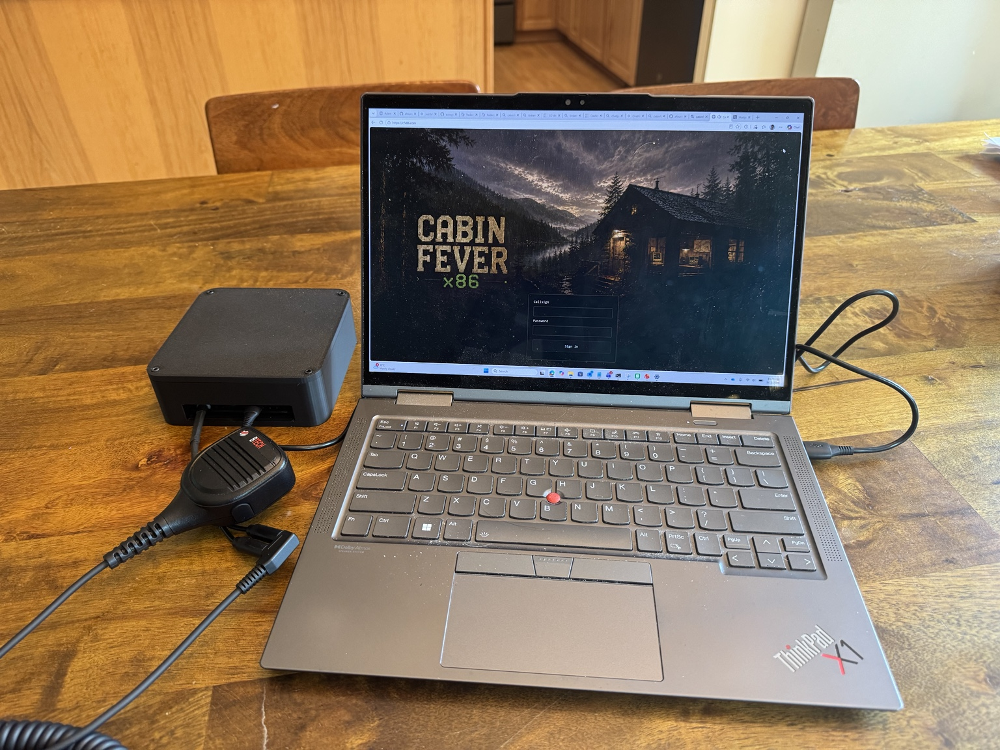
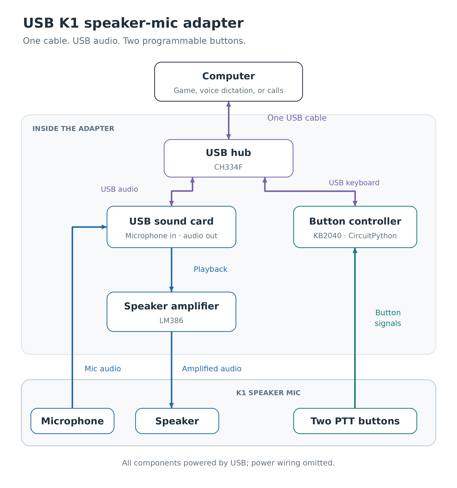
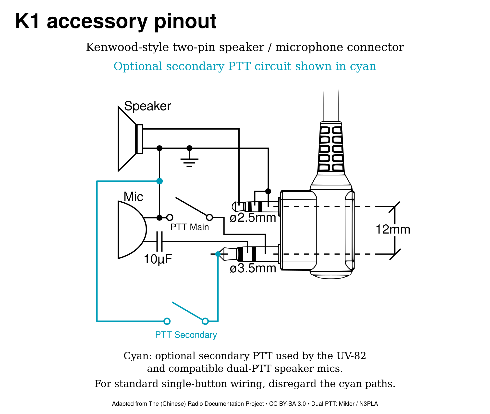
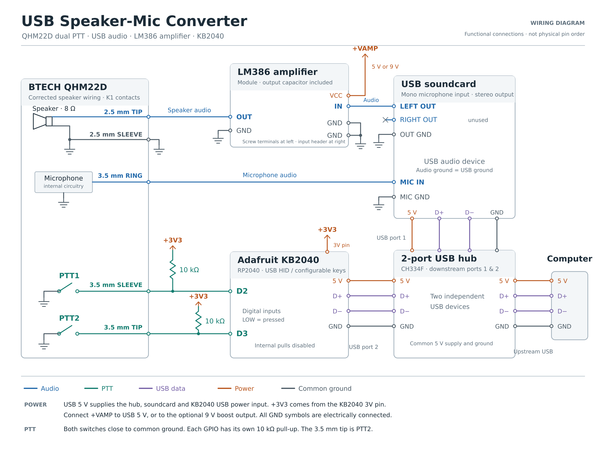
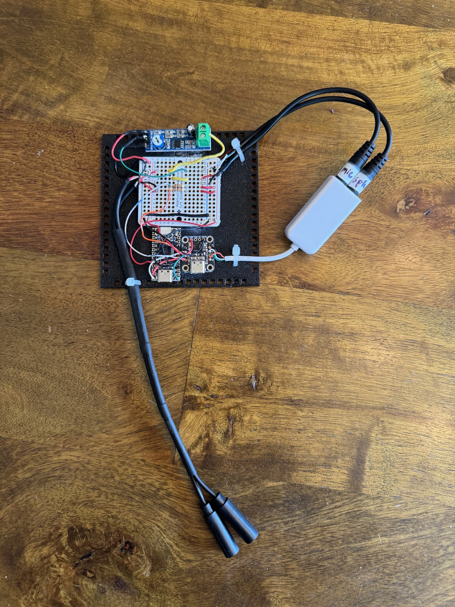
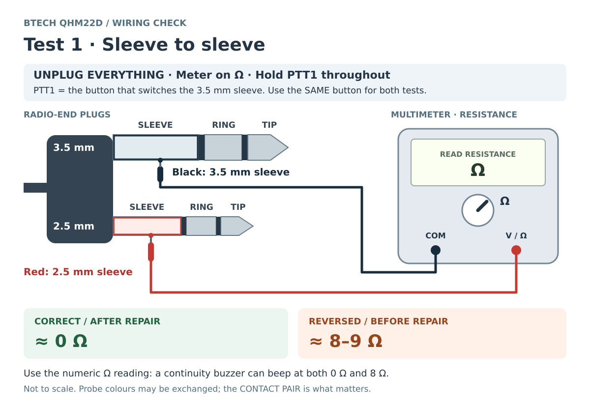
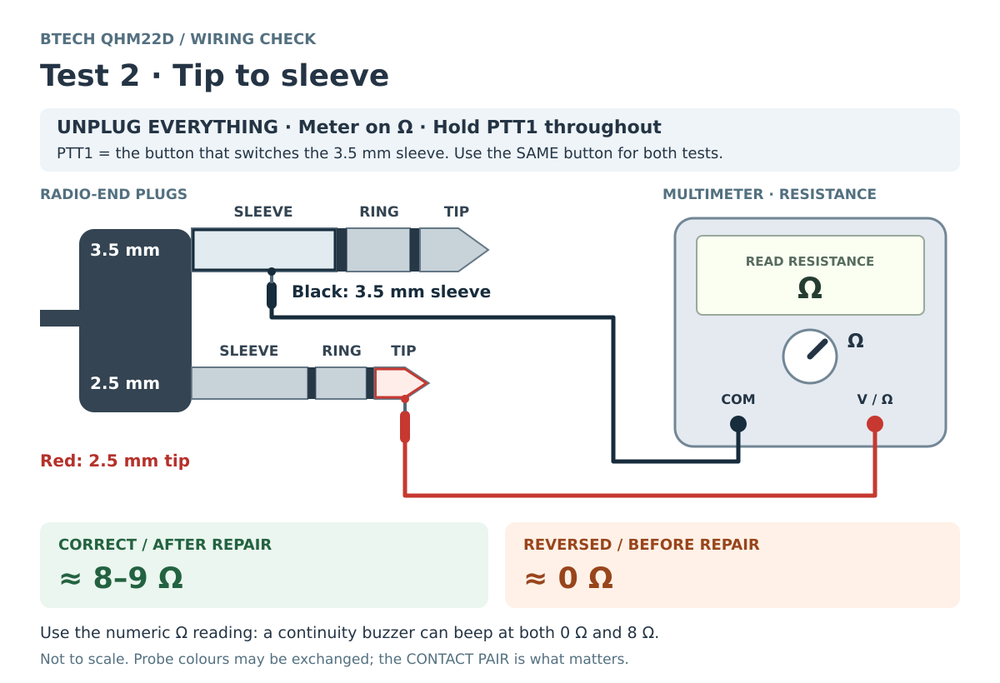
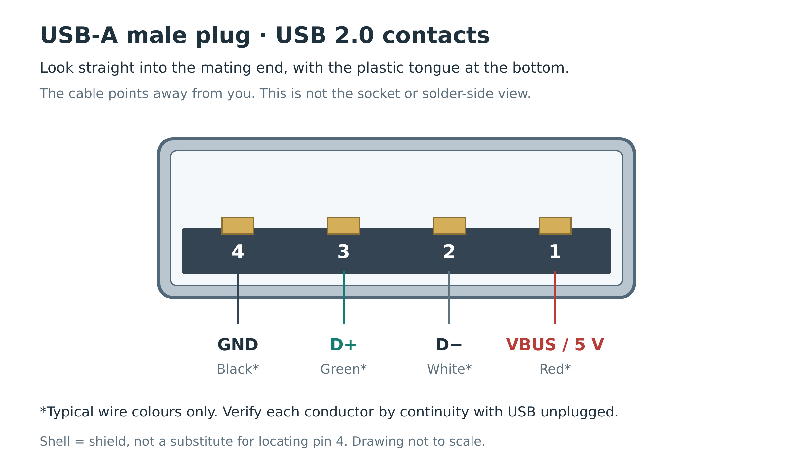
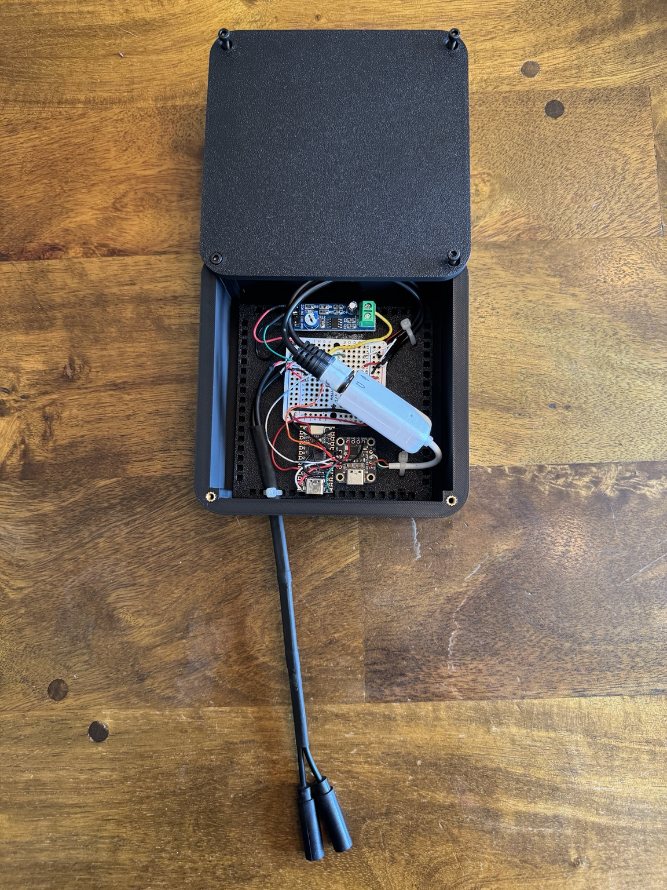
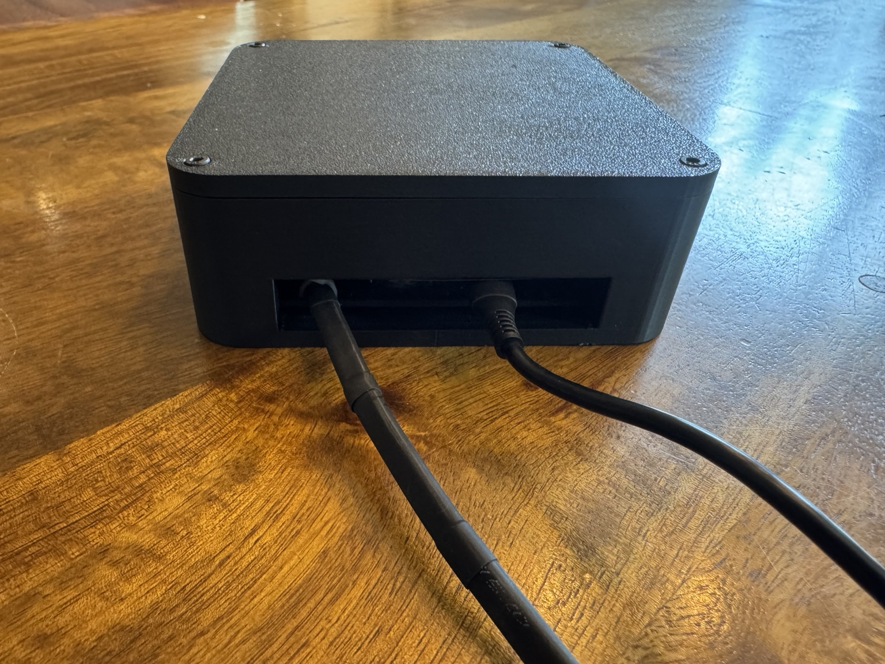

# USB K1 Speaker-Mic Adapter

A shoulder mic, a handful of breakout boards, and one USB cable. This adapter turns a Kenwood-style K1 radio speaker mic into a USB microphone, an amplified speaker, and two programmable push-to-talk buttons.

The excuse for building it was [Cabin Fever x86](https://github.com/afourney/cabin-fever-x86), a conversational text-adventure game played over a radio. If you're going to talk someone through an old text adventure, a proper shoulder mic feels like the right hardware. Squeeze the button, say your piece, and hear the reply through the same handset.

It also makes a satisfying physical interface for [Claude Code `/voice`](#claude-code) or [Teams](#microsoft-teams). Asking an agent to fix your code over a radio is optional. Saying “over” is between you and the transcription service.



*Ready to talk: the adapter and a BTECH QHM22D running Cabin Fever x86. Building with this mic? Read the [BTECH-specific wiring checks](docs/btech-qhm22d.md) first.*

## Video demo
[](https://www.youtube.com/watch?v=ixthcVkOpio)

## What's in the box?

The useful trick is to let ordinary USB devices do most of the work. A USB sound card handles microphone input and audio output. An LM386 module gives the little speaker enough drive to be heard. An Adafruit KB2040 running CircuitPython watches the two PTT buttons and presents them to the computer as keyboard keys. A tiny USB hub brings the audio and keyboard devices out through one cable. The supplied firmware sends **F13** from the main button and **Ctrl+Space** from the secondary button; both bindings are editable.

[](hardware/usb-k1-block-diagram.png)

*The sound card handles audio; the KB2040 turns button presses into keystrokes. Everything is powered from USB. Power wiring and individual connector contacts are left to the [schematic](#from-radio-accessory-to-usb-peripheral).*

## The K1 connector

The K1 connector has its roots in Kenwood's two-pin speaker/microphone interface: a 3.5 mm plug and a 2.5 mm plug mounted side by side. You'll find this Kenwood-style connection on handhelds from several manufacturers, notably the ubiquitous BaoFeng UV-5R. That shared connector gives us a ready-made supply of shoulder mics, earpieces, and other accessories to borrow for a USB project. [BTECH's compatibility list](https://baofengtech.com/product/qhm22d/) includes the UV-5R alongside models from Kenwood-style accessory families such as AnyTone, TYT, and Retevis.

A speaker mic already contains most of what we need: a microphone, a speaker, and a physical push-to-talk switch, all brought out through that pair of plugs. The audio connections are analog, and the PTT button closes a circuit. A compatible dual-PTT mic adds a second switch, giving us two independently readable buttons.

### K1 accessory pinout



### From radio accessory to USB peripheral

Almost everything is already in place. The microphone can feed a suitable USB sound card's mic input, which supplies the electret bias. That leaves two jobs for the adapter.

First, the handset's **8 Ω speaker needs more drive than this USB sound card can provide directly**. It's a heavier load than a typical pair of headphones, and direct playback in this build was much too quiet. The LM386 module sits between the sound card's output and the speaker to supply the extra drive. It fits this build because it can drive a speaker with one side connected to **common ground**. This is important because the K1 handset shares that return between its speaker and PTT switches, ruling out bridge-output amplifiers such as the PAM8403, which actively drive both speaker terminals. Connecting such an amp's speaker “−” output to the adapter's common ground would short that output to ground.

The LM386 development boards used here come configured for approximately **200× voltage gain**. That's more than we need from a USB sound card and makes it easy to overdrive the amplifier. The LM386's default gain is **20×**; the board raises it with an external network between pins 1 and 8. See the [TI LM386 datasheet's gain-control section](https://www.ti.com/lit/ds/symlink/lm386.pdf#page=10). On the blue module used in this build, R1 is a 0 Ω jumper in the gain-boost network between pins 1 and 8. With power disconnected, **desolder R1 and leave its pads open**. This disconnects the boost network and returns the gain to **20×**. Check the board revision before modification since component labels are not universal.

While the sound card and amplifier take care of audio, we still need a way to report the handset's PTT switches to the computer—this is the second job of the adapter. Those buttons simply close electrical contacts that pull to ground. A microcontroller provides the missing link: it reads the switches and presents itself to the computer as a **USB HID keyboard**. Pressing a PTT button then looks like holding a keyboard key; releasing the button releases the key. Applications can use their [existing keyboard shortcuts](#using-it-with-applications) for push-to-talk, without needing a custom interface to the handset.

The **Adafruit KB2040** was chosen for a practical wiring detail: its **USB D+ and D− signals are broken out to accessible pads beside the USB-C connector**. That makes it straightforward to wire the USB data connection directly to the internal hub without soldering onto the connector's tiny contacts. Adafruit documents these pads in the [KB2040 pinout guide](https://learn.adafruit.com/adafruit-kb2040/pinouts). The board's RP2040 also provides native USB support and more than enough inputs for the two switches. Programming the board and choosing what each button sends are covered later in [firmware setup](#install-circuitpython-and-the-firmware).

The following wiring diagram shows the complete adapter, including the USB hub, sound card, LM386 module, KB2040, and K1 handset. The speaker mic block simplifies the handset's internal circuitry.

[](hardware/speaker-mic-converter.svg)

The build photo shows the LM386 at the top, the prototyping board in the middle, the KB2040 and USB hub below, and the separate USB audio adapter to the right. Follow the schematic and contact labels rather than copying wire colours from this overview.



## Parts and tools

Most of the work here is joining existing modules. These are the parts used in the documented build, with a reference part where the exact SKU wasn't recorded. Substitutions are fine if the electrical requirements match; check the board revision before copying a modification.

| Qty | Part | Purpose and selection notes |
| ---: | --- | --- |
| 1 | K1 Speaker Mic (e.g., [BTECH QHM22D dual-PTT speaker microphone](https://baofengtech.com/product/qhm22d/) · [Amazon](https://www.amazon.com/dp/B085HG7RX8)) | Kenwood K1-style two-plug connector, speaker, microphone, and one or two buttons. **Handset wiring can vary. [Test your handset before use!](#handset-wiring-check)** See the [BTECH-specific instructions](docs/btech-qhm22d.md) if using the QHM22D. |
| 1 | [Adafruit KB2040, product 5302](https://www.adafruit.com/product/5302) | RP2040 board for USB HID keyboard events. The supplied firmware uses its `D2`, `D3`, and `BUTTON` names. |
| 1 | [Adafruit CH334F Mini 2-Port USB Hub Breakout, product 5999](https://www.adafruit.com/product/5999) | Connects sound card and KB2040 to one upstream USB cable. Downstream connections are solder pads. |
| 1 | USB audio adapter with separate microphone and headphone jacks · [documented reference: Adafruit 1475](https://www.adafruit.com/product/1475) | Needs a microphone input suitable for an electret mic, including mic bias, and a ground-referenced headphone/line output. The exact SKU of the cabled adapter in the photos is unrecorded; do not assume its jack wiring from its appearance. |
| 1 | [LM386 audio amplifier module](https://protosupplies.com/product/lm386-audio-amplifier-module/) | The documented blue module has an input level trimmer and an output coupling capacitor. Use the capacitor-coupled output and common ground shown in the schematic. The prototype had its gain-setting **R1 removed**. |
| 2 | 10 kΩ resistors | One pull-up from each PTT input to the KB2040's regulated **3.3 V** output. Ordinary ¼ W resistors are sufficient. |
| 1 | [Adafruit Perma-Proto Quarter-sized Breadboard PCB, product 589](https://www.adafruit.com/product/589) | Carries the audio/PTT junctions and two resistors. One board is needed; the linked product is a pack of three. |
| 1 | One female **3.5 mm TRS** pigtail [Amazon](https://www.amazon.com/dp/B0C694NKJM) | Must expose all three contacts. If pigtails are not available, simply cut a short 3.5 mm extension cable and strip its wires. |
| 1 | One female **2.5 mm TRS** pigtail [Amazon](https://www.amazon.com/dp/B09V15J2MH) | Same as above. Cut an audio extension cable if pigtails are not available. |
| 2 | Short 3.5 mm male audio pigtails/breakouts [Amazon](https://www.amazon.com/dp/B0DMM3YFY1) | One for sound-card mic input; one for headphone output. This can be the other end of an extension cable if you cut one. |
| 1 | Upstream USB **data** cable | Computer to the hub's USB-C socket; choose the computer-end connector you need. |
| As needed | Heat-shrink, solder, cable ties, standoffs, screws | Keep USB data wiring short and paired. Insulate exposed connections and provide cable strain relief. |
| 1 | Nonconductive project box and mounting plate | Print the [supplied enclosure](docs/enclosure.md#print-the-enclosure), or size a project box around your assembled modules, plug bodies, cable bends, and lid clearance. |

The original diagram also shows an optional 9 V amplifier supply. **The instructions below use USB 5 V throughout.** A boost converter is unnecessary for the basic build; the prototype's 5 V/9 V comparison did not show a useful improvement for voice. Never feed 9 V into USB power, the KB2040, or a PTT input.

You will also need a multimeter with a low-ohms range, a soldering iron and flux, cutters/strippers, small screwdrivers, and a computer for copying files and testing USB audio. Fine tweezers and desoldering braid help with the amplifier's surface-mount gain resistor.

## Assembly Tips and Gotchas

### Handset wiring check

Handsets can be wired differently. Some BTECH QHM22D units, for example, have [been reported miswired](docs/btech-qhm22d.md) and need a repair before they can be used.

1. Unplug the handset from all equipment, including external earphones. Set the multimeter to resistance and touch the probes together to note the lead resistance.
2. Hold the main PTT button. Measure between the **3.5 mm sleeve** and **2.5 mm sleeve**: expect approximately **0 Ω**, plus probe/contact resistance.
3. Keep that same button held and move the probe from the **2.5 mm sleeve** to the **2.5 mm tip**. Expect the speaker-coil resistance—approximately **8–9 Ω** on the QHM22D used here.
4. Release the button and confirm that the sleeve-to-sleeve short disappears. For a compatible dual-PTT handset, also check **3.5 mm tip ↔ 2.5 mm sleeve**: pressing the secondary button should produce a near-zero reading, and releasing it should remove that short.

**Sleeve** means the metal contact nearest the cable; **tip** means the contact at the end of the plug. Use the numeric resistance reading: a continuity buzzer may beep for both 0 Ω and 8 Ω.

[](hardware/testing/qhm22d-test-1.svg)

[](hardware/testing/qhm22d-test-2.svg)

*These diagrams show the BTECH QHM22D checks. If the two resistance readings are reversed, follow the [BTECH-specific repair instructions](docs/btech-qhm22d.md). Other handsets may have different speaker resistance or switching; investigate unexpected results before connecting them.*

### USB sound card preparation

The Adafruit CH334F Mini hub does not have any sockets for the client USB devices. The sound card and KB2040 must be wired to the hub's downstream pads. With USB disconnected, prepare the sound card by clipping the original USB cable and stripping the wires. Identify the four wires by continuity; use colour only as a clue. In my device, the colours were red = 5 V, black = GND, green = D+, and white = D−. It is important to check your own device, as the colours are not guaranteed to be the same. To do this, strip the wires on the connector end as well, and check continuity between the wires and the USB contacts. Use the following pinout to identify the contacts:

[](hardware/testing/usb-a-male-pinout.svg)

*View the male plug straight into its mating end, with the plastic tongue at the bottom and the cable pointing away from you. From left to right: pin 4 = GND, pin 3 = D+, pin 2 = D−, pin 1 = VBUS (5 V). Colours are typical, not guaranteed. Pin assignments and orientation follow the [USB 2.0 specification](https://www.usb.org/document-library/usb-20-specification), Table 6-1 and Figure 6-9.*

When connecting the sound card to the hub, keep the wires short and the D+/D− data pair twisted together. Do the same when connecting the KB2040 to the hub.

### Don't mix up your positive rails!

When wiring all the modules, note that all components share a common ground, but there are two positive rails: the USB 5 V and the KB2040's regulated 3.3 V. The LM386 module, USB hub, and USB devices (sound card and KB2040) are powered from the USB 5 V. On the KB2040, the `RAW` pin is on the USB-derived power rail, after the protection diode and fuse by default; see the [power pinout](https://learn.adafruit.com/adafruit-kb2040/pinouts). The KB2040 board has a 3.3 V regulator that then powers the onboard RP2040 microcontroller. **The two PTT inputs are pulled up to the KB2040's 3.3 V rail, <u>not the USB 5 V.</u>**

### Reduce excessive gain

As explained above, the LM386 development board starts at approximately **200× gain**. With power disconnected, **desolder the 0 Ω R1 jumper and leave its pads open** to disconnect the gain-boost path and return the LM386 to **20× gain**. Then set the onboard trimmer pot to about 1/3–1/2 of its range, and test the audio. If the sound is still harsh or distorted, reduce the trimmer further. The trimmer is not a gain control; it simply reduces the input level to the amplifier.

## Install CircuitPython and the firmware

Once CircuitPython is installed, changing what the buttons do is a text-file edit. The first flash takes a few more steps:

1. Download the stable [CircuitPython UF2 for **Adafruit KB2040**](https://circuitpython.org/board/adafruit_kb2040/).
2. With the board unplugged, hold **BOOT** while connecting its USB data cable. Release BOOT when the `RPI-RP2` drive appears. If the board is already wired to the hub, use that connection instead of a second USB cable.
3. Copy the `.uf2` file to `RPI-RP2`. The board restarts and exposes a drive named `CIRCUITPY`.
4. Download the [Adafruit CircuitPython library bundle](https://circuitpython.org/libraries) matching the major CircuitPython version in `CIRCUITPY/boot_out.txt`.
5. Copy the bundle's entire `adafruit_hid` folder into **`CIRCUITPY/lib/adafruit_hid/`**.
6. Copy [firmware/code.py](firmware/code.py) to **`CIRCUITPY/code.py`**. It belongs in the drive root, not inside `lib`. On Windows, show file extensions and check that it is not named `code.py.txt`.
7. Saving the file normally restarts the program. Later edits require only saving `code.py`, not flashing the UF2 again.

The supplied configuration is:

```python
PTT1_KEY = Keycode.F13
PTT2_KEY = (Keycode.LEFT_CONTROL, Keycode.SPACE)
BOOT_ALIASES_PTT1 = True
USE_INTERNAL_PULLUPS = False
DEBOUNCE_SECONDS = 0.020
POLL_SECONDS = 0.002
LOG_CHANGES = True
```

| Input | While held | On release |
| --- | --- | --- |
| PTT1 / D2 | F13 | Releases F13 |
| PTT2 / D3 | Left Ctrl + Space | Releases the chord |
| Onboard BOOT, after normal startup | F13 | Releases F13 when D2 is also released |

Change the keyboard mapping by adjusting `PTT1_KEY` and/or `PTT2_KEY`. For example, `PTT2_KEY = Keycode.SPACE` or `PTT2_KEY = Keycode.F14`. A Python tuple (e.g., `(Keycode.LEFT_CONTROL, Keycode.SPACE)`) represents a chord where both keys are held together. Here, pushing the button sends Ctrl+Space; releasing it releases both keys. The onboard BOOT button aliases PTT1 and is useful for testing the firmware before assembly or before any handset is attached. NOTE: as usual, holding BOOT at startup enters the bootloader.

Each input is debounced for 20 ms. When a PTT button is held, it holds keys as a keyboard would. The operating system may generate key-repeat events.

**External pull-ups are required by the default firmware.** For a temporary test of a bare KB2040 without the resistors, set `USE_INTERNAL_PULLUPS = True` before running it; restore `False` when both external 10 kΩ resistors are installed. Otherwise unconnected inputs float and can send unintended keys.

## Test the complete adapter

Now it's time to verify that the adapter works as intended. Start by checking the buttons and audio separately, then test them together with an application.

### Buttons first

1. Open the [W3C Keyboard Event Viewer](https://w3c.github.io/uievents/tools/key-event-viewer.html) and focus its input.
2. Hold PTT1: expect F13 down. Release it: expect F13 up. F13 does not type a visible character.
3. Hold PTT2: expect Control and Space with Ctrl active. Release it and check that **both** keys are released.
4. Hold both handset buttons; release them in each order. Each input should release without interfering with the other.

If these checks fail, use the [serial-console guide](docs/serial-console.md) to check the firmware's log messages for errors.

### Then audio

1. Select the USB sound card as the computer's input and output device, or select it explicitly in the application. Device names vary.
2. Record a short voice sample.
3. Start playback at low computer volume and low amplifier level. Slowly raise the level while listening to speech.
4. If the speaker sounds harsh or buzzy, turn down the computer output or amplifier input trimmer. The prototype was clear for voice but could clip on music.

## Mount it in an enclosure

The last component is a box to hide our wiring sins and protect the modules. The [enclosure folder](enclosure) includes STLs for the body, lid, and mounting plate with standoffs, plus a [Bambu Lab P1S 3MF project](enclosure/K1%20Adapter%20Box.3mf). You can also find the enclosure on [MakerWorld](https://makerworld.com/en/models/3343715-usb-k1-speaker-mic-adapter-enclosure#profileId-3799259). Test the complete assembly before closing it up. Mount each board on an insulating plate or standoffs, secure the audio adapter, and strain-relieve the USB and K1 cables. Leave room for the plug bodies and access to the amplifier trimmer and KB2040 reset/BOOT buttons. Keep solder joints clear of screws and the lid.

| Open enclosure | Finished cable entry |
| --- | --- |
|  |  |

See [enclosure and mounting notes](docs/enclosure.md) for print settings and fitting the electronics. After mounting, repeat the button and audio tests while gently moving the cables. Nothing should disconnect, crackle, or generate a button press from cable movement.

## Using it with applications

At this point the computer sees audio hardware and a keyboard. Choose the USB sound card for audio, then tell the application what its PTT key should do. The application decides when to listen; the adapter supplies the sound and button presses.

### Cabin Fever x86

Use the adapter with [Cabin Fever x86](https://github.com/afourney/cabin-fever-x86). Select the USB microphone, grant the browser microphone permission, and route playback to the USB sound card. Match the handset's firmware binding to the game's current PTT control. Check that releasing the button ends the recording before a full session.

### Claude Code

Select the USB microphone as the host's input, enable `/voice hold`, and focus the prompt. Claude Code's default dictation key is Space; to test that path, set `PTT2_KEY = Keycode.SPACE` in the firmware. In hold mode, terminal key repeat must be enabled. See the official [voice dictation guide](https://code.claude.com/docs/en/voice-dictation).

To try the repository's **default Ctrl+Space** instead, merge the following into `~/.claude/keybindings.json` in the environment running Claude Code:

```json
{
  "bindings": [
    {
      "context": "Chat",
      "bindings": {
        "ctrl+space": "voice:pushToTalk"
      }
    }
  ]
}
```

This is a configuration example, **not a confirmed fix for Windows Terminal/WSL2**. Ctrl+Space did not work reliably in the original setup. Check terminal shortcut interception and the key received by Claude Code; use `/keybindings` and the [keybinding documentation](https://code.claude.com/docs/en/keybindings). A native browser receiving the HID chord does not prove that the terminal forwards it correctly. For WSL, also verify that its audio input works through WSLg.

#### Auto-submit on release

To send your dictated prompt when you release the PTT button, merge this into `~/.claude/settings.json` in the environment running Claude Code (inside WSL if that is where you run it). Keep any other settings already in the file:

```json
{
  "voice": {
    "enabled": true,
    "mode": "hold",
    "autoSubmit": true
  }
}
```

Hold the configured PTT button, speak, then release it. Claude Code finalizes the transcript and submits the prompt automatically if the transcript contains **at least three words**. Shorter transcripts stay in the input for manual submission with Enter. Set `"autoSubmit": false` to review every dictated prompt before sending. See the official [hold-to-record and auto-submit instructions](https://code.claude.com/docs/en/voice-dictation#hold-to-record).

### Microsoft Teams

Select the USB mic and speaker in Teams, then check the installed client's keyboard shortcuts for its press-and-hold temporary-unmute action. The firmware's Ctrl+Space binding is intended for clients that offer that shortcut. Test from a muted meeting with the intended window focus: hold to speak, release, and verify that the mute indicator returns. A single shared keybinding working in both Teams and Claude Code has **not been established for this build**.

## Troubleshooting

| Symptom | Check |
| --- | --- |
| Speaker works, but PTT fails or changes when headphones are inserted into the handset | For the BTECH QHM22D, follow the [wiring-test and repair guide](docs/btech-qhm22d.md). For other handsets, verify their wiring against the pinout. |
| Random key presses, or a button appears held | Both 10 kΩ pull-ups must connect to 3.3 V; confirm handset ground, correct socket contacts, and that the plugs are fully seated. |
| PTT is always active | Check that the K1 3.5 mm sleeve was not mistaken for common ground. |
| BOOT works but handset buttons do not | Check D2/D3 versus A2/A3, connector continuity, pull-ups, and each switch's resistance to ground. |
| Nothing appears over USB | Use a data cable; inspect upstream/downstream assignment, D+/D−, 5 V, and GND. Test each device separately. |
| Audio or keyboard disappears when the speaker gets loud | Reduce playback level; investigate supply sag, shorts, poor ground connections, and the USB source's current budget. |
| Speaker is extremely quiet | Check that playback passes through the powered LM386 and its level trimmer is not at minimum. |
| Harsh or distorted playback | Lower sound-card output and amplifier input level; confirm the intended gain modification. |
| No mic signal | Check the selected USB input, app permission, mic bias, K1 ring mapping, and whether the handset gates audio with its buttons. |
| Music is missing instruments or voices | Only the left channel is wired. Enable host mono output. |
| Firmware import error | Install the matching `adafruit_hid` folder under `CIRCUITPY/lib/`. |
| Keys work in a browser but not Claude Code | Check terminal key translation/interception and Claude Code's active binding. |
| Serial console is blank or PuTTY beeps | Follow [serial-console setup](docs/serial-console.md), including selecting Serial on the Session page. |

## References

### K1 diagram sources

- [The (Chinese) Radio Documentation Project's original SVG](https://github.com/radiodoc/uv-5r/blob/master/assets/images/kenwood-2pin-headset.svg) — Source artwork for the K1 diagram, licensed under CC BY-SA 3.0; the adapted PNG and SVG retain that license. This adaptation removes the +5 V label, adds the cyan secondary-PTT circuit, and revises the labels and captions.
- [The project's UV-5R manual](https://radiodoc.github.io/uv-5r/) — Original publication containing the accessory diagram.
- [Miklor's UV-82 technical notes](https://www.miklor.com/COM/UV_Technical.php) — Explains UV-82 dual-PTT operation and wiring.
- [Walt N3PLA's circuit diagram](https://www.miklor.com/COM/images/dualPTT-N3PLA.jpg) — Circuit reference for the added secondary-PTT wiring.
- [Kenwood's TH-F6A/TH-F7E manual, printed page 45](https://kasc.kenwood.com/files/images/products/product_id_268/file_category_10/TH-F6A_F7E_inst.pdf#page=50) — Corroborates the conventional speaker, microphone, and main-PTT contacts.
- [BaoFeng Tech's UV-82HP manual, printed page 19](https://baofengtech.com/wp-content/uploads/2020/09/UV82HP_Manual_ReducedSize.pdf#page=26) — Documents upper/lower-channel PTT operation; its generic accessory drawing does not show the second switch.

## Copyright and license

Copyright © 2026 Adam Fourney.

Licensed under the [MIT License](LICENSE), except for the adapted K1 accessory diagram, which retains its CC BY-SA 3.0 license as noted above. Please retain the copyright and license notices when redistributing this work.
