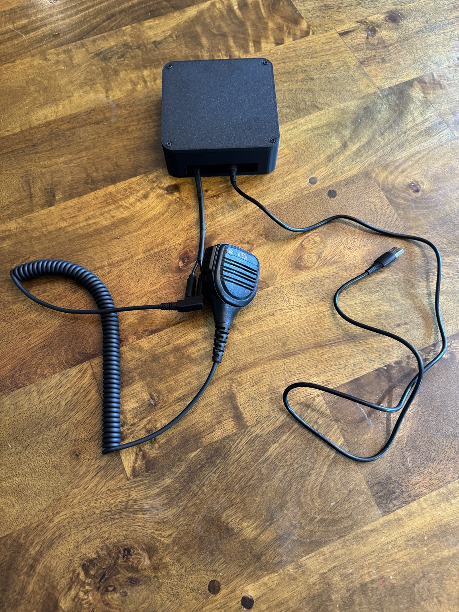

# Enclosure and mounting

[Back to the build guide](../README.md)

The prototype uses a rectangular enclosure with a removable lid and an internal mounting plate. The K1 female pigtails and upstream USB cable leave through the front opening. Print files are included in the [enclosure folder](../enclosure).

## Print the enclosure

| File | Contents |
| --- | --- |
| [K1 Adapter Box.3mf](../enclosure/K1%20Adapter%20Box.3mf) | Bambu Studio project configured for a **Bambu Lab P1S with a 0.4 mm nozzle**, with all parts arranged across three plates. |
| [K1 Adapter Box Body.stl](../enclosure/K1%20Adapter%20Box%20Body.stl) | Box body with the front cable opening and four corner screw holes. |
| [K1 Adapter Box Lid.stl](../enclosure/K1%20Adapter%20Box%20Lid.stl) | Removable lid. |
| [Base Plate and Standoffs.stl](../enclosure/Base%20Plate%20and%20Standoffs.stl) | Internal mounting plate and separate standoffs, grouped in one STL. |

The body measures **125 × 125 × 40 mm** in the supplied mesh; the lid is **125 × 125 × approximately 5 mm**.

For the P1S, download the 3MF and open it as a project in Bambu Studio to retain its settings and part placement. Plate 1 contains the body, plate 2 the lid, and plate 3 the mounting plate and standoffs. The saved settings use 0.20 mm layers, three walls, 20% infill, enabled supports, a Textured PEI Plate, and an eSUN PLA+ filament preset. Confirm the filament and build plate match your setup, then slice and preview each plate before printing. The project contains models and settings, rather than pre-sliced G-code.

For another printer or slicer, use the individual STLs at **100% scale in millimetres** and configure the print for your machine. The 3MF places the body open-side up, the lid flat, and the mounting plate and standoffs flat on the bed.

## Mount the electronics

Dry-fit the printed parts and electronics before fastening anything. If using a different project box, the same layout and clearance checks apply.

1. Arrange the amplifier, prototyping board, KB2040, hub, and audio adapter on the mounting plate. If using a different box, establish this layout before choosing its size.
2. Include the full length of inserted audio and USB plugs in your measurements. Leave room for their cables to bend without pushing sideways on sockets.
3. Check lid clearance above the tallest part, including screw heads, cable ties, and any underside solder joints.
4. Plan access to the amplifier trimmer and the KB2040 BOOT/reset buttons. The hub connection can carry firmware updates, but physical button access is still useful for recovery.
5. Fix boards with suitable standoffs or nonconductive mounts. Secure the cased audio adapter separately so its mass cannot tug on USB solder joints.
6. Fit strain relief at cable exits. A pull on the outside cable should be taken by the enclosure or mounting plate, not by a PCB pad.
7. Keep analog microphone wiring away from USB data wiring and the amplifier power/output loop where practical.
8. Inspect for exposed conductors touching mounting hardware, then repeat the functional tests after assembly.

The two flying K1 sockets preserve access to the handset's existing plug. They also avoid needing to reproduce its exact two-plug spacing in a drilled panel.

## Design changes

The STL files provide the printable meshes, and the 3MF preserves the slicer project. Editable source CAD is not included. When contributing revisions, include the source CAD if available and record any changes to fasteners, clearances, or print settings.
